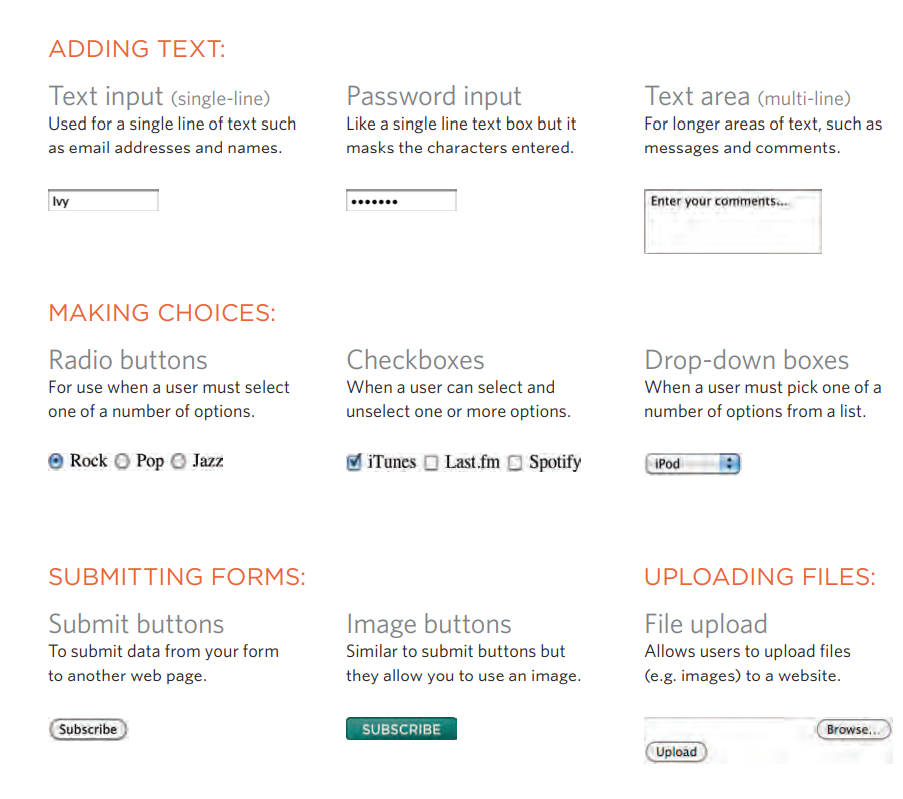
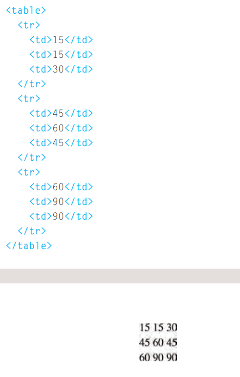
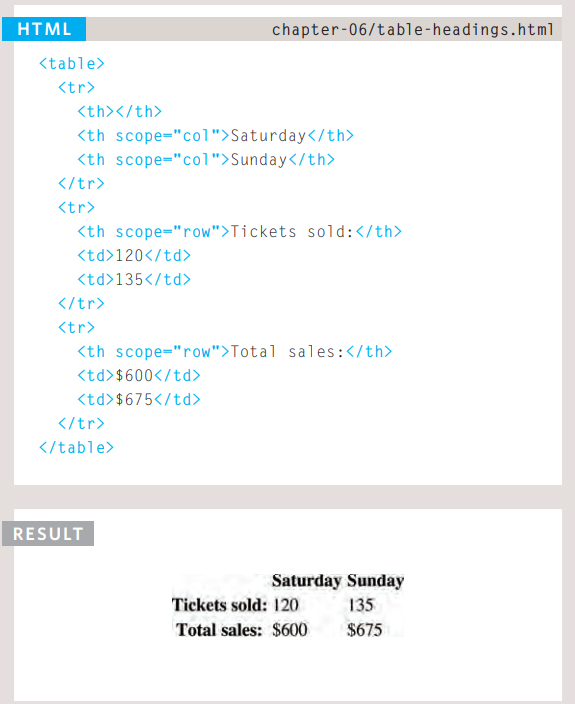

# Forms

The best known form on the web is probably the search box that sits right in the middle of browsser&#39;s homepage.

Form Controls

we have several types of form controls that you can use to collect data from visitors to your link.
Basic Table temple

 

1: Outlines When you hover over an portion, a red outline will be drawn around it, showing you how much space the portion

2: temple While you are hovering over an portion, the temple will be shown at the top of the window. Here you can see the portion has a set of completed, inside a with a set called to-do. The list is inside a portion with an id of page, and this sits inside the and portions. This can be very helpful when writing CSS select to help you target the right portion

3: CSS look When hovering over an portion, click with your mouse to display the CSS. You will be shown the rules that ask for to that portion (and the line they are on). Above the rules, you can see the name of the style sheet (and the path to it). This helps check which look are being applied to an portion. You can use it on code for your own link or when you want to see what look someone else is using on their link.