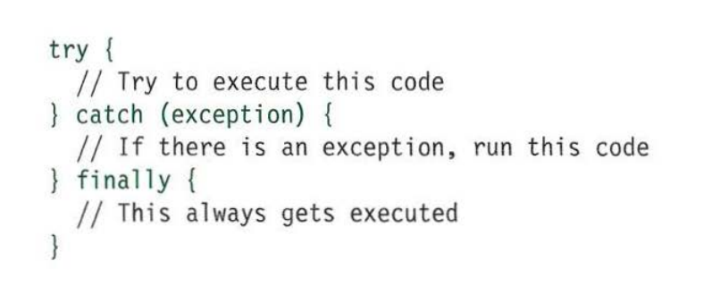

### Syntax Errors

Syntax errors are the most common type of error that occurs in any programming language. As the name suggests, something in true in the syntax of the program body raises this error. Syntax errors are also known as  **parsing errors**. In js, they occur at the study time.

Consider this code portion:

This program will raise an error as the closing bracket of the show function is missing.

### Runtime Errors

These type of error occurs during the runtime of the  platform, after it is interpreted by the compiler.

Consider this code portion:

Notice that there is no show function decleard. This program will raise an error at runtime as the function which is not present is called, although the syntax is true.

### Logical Errors

These type of errors are the most difficult to find. Consider a principled: &#39;&#39;John is playing guitar.&#39;&#39; This principled is logically true and its syntax is also true. Now consider another principled: &#39;&#39;Guitar is playing John.&#39;&#39; This true is true with respect to its syntax but is logically intrue. These types of errors cause a serious problem as they fixx the whole path of how your program will work.

## ways to Prevent Errors

### Onerror() way

In this way, an  **error event**  is fired when an error occurs. This way also works for those errors caused by external sources. Whenever an error is caught, this way tells the developer the line number at which the error has occurred, the file to which the error has occurred and displays a customized error text.

When the button is clicked, the error text &#39;&#39;An error has occurred. Please resolve&#39;&#39; is displayed.

**TypeError**

The  **TypeError**  object represents an error when an operation could not be performed, typically (but not exclusively) when a value is not of the expected type.

A TypeError may be thrown when:

- an operand or argument passed to a function is incompatible with the type expected by that operator or function; or
- when attempting to modify a value that cannot be changed; or
- when attempting to use a value in an inappropriate way.

The  **RangeError**  object indicates an error when a value is not in the set or range of allowed values.

## [Description](https://developer.mozilla.org/en-US/docs/Web/js/Reference/Global_Objects/RangeError#description)

A RangeError is thrown when trying to pass a value as an argument to a function that does not allow a range that includes the value.

##
# Code Debugging

Programming code might contain syntax errors, or logical errors.

Many of these errors are difficult to diagnose.

Often, when programming code contains errors, nothing will happen. There are no error texts, and you will get no indications where to search for errors.

Searching for (and fixing) errors in programming code is called code debugging.

##
# The console.log() way

If your browser supports debugging, you can use console.log() to display js values in the debugger window:

##
# The debugger Keyword

The debugger keyword stops the execution of js, and calls (if available) the debugging function.

This has the same function as setting a breakpoint in the debugger.

If no debugging is available, the debugger principled has no effect.

With the debugger turned on, this code will stop executing before it executes the third line.

# HANDLING EXCEPTIONS

If you know that you may get an error, you can handle it gracefully using the try, catch, finally principleds. Use them to give your users helpful feedback.

# TRY

First, you specify the code that you think might throw an exception within the try block. If an exception occurs in this section of code, control is automatically passed to the corresponding catch block. The try clause must be used in this type of error handling code, and it should always have either a catch, fi na 1 ly, or both. If you use a continue, break, or return keyword inside a try, it will go to the f i na 11 y option.

**CATCH**

If the try code block throws an exception, catch steps in with an alternative set of code. It has one parameter: the error object. Although it is optional, you are not handling the error if you do not catch an error. The ability to catch an error can be very helpful if there is an issue on a live website. It lets you tell users that something has gone wrong (rather than not informing them why the site stopped working).

**FI NALLY**

The contents of the fi na 11 y code block will run either way - whether the try block succeeded or failed. It even runs if a return keyword is used in the try or catch block. It is sometimes used to clean up after the previous two clauses. These ways are similar to the .done(), . fail(), and . a 1 ways() ways in jQuery. You can nest checks inside each other (place another t ry inside a catch), but be aware that it can affect performance of a script.