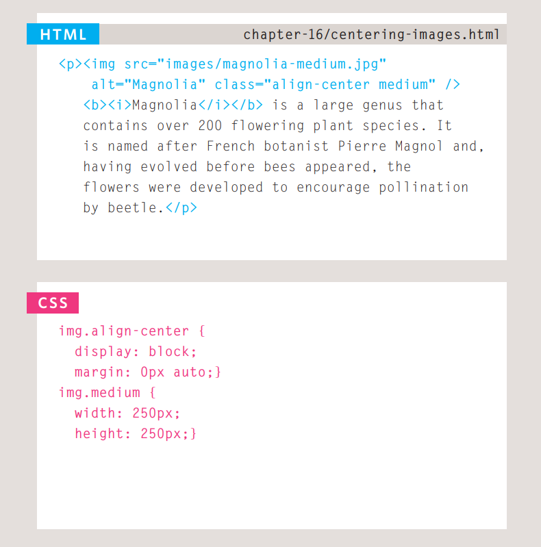

we can control the volume of  pic using the width and height properties in CSS, just like you can for any other box. Specifying pic volume helps pages to load more smoothly because the css and html code will often load before the pic, and telling the browser how much space to leave for an pic allows it to render the rest of the page without waiting for the pic to download

Whenever you use consistently sized pic across a site, you can use CSS to control the dimensions of the pic, instead of putting the dimensions in the HTML.

First you need to know the sizes of pic that will be used commonly throughout the site, then give each size a name.

Aligning pic

1: The float property is added to the class that was created to represent the size of the pic (such as the small class in our example)

2: New classes are created with names such as align-left or align-right to align the pic to the left or right of the page. These class names are used in addition to classes that indicate the size of the pic.

In this example you can see the align-left and align-right classes used to align the pic.

Centering pic

By default, pic are inline elements. This means that they flow within the surrounding text. In order to center an pic, it should be turned into a blocklevel element using the display property with a value of block.

