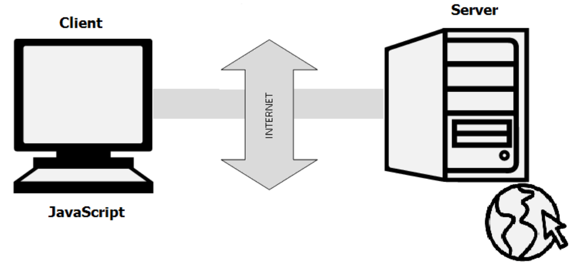

What is JavaScript?
JavaScript is a very powerful client-side scripting language. JavaScript is used mainly for enhancing the interaction of a user with the webpage. In other words, you can make your webpage more lively and interactive, with the help of JavaScript. JavaScript is also being used widely in game development and Mobile application development.

JavaScript is a client-side scripting language developed by Brendan Eich.
JavaScript can be run on any operating systems and almost all web browsers.
You need a text editor to write JavaScript code and a browser to display your web page.
