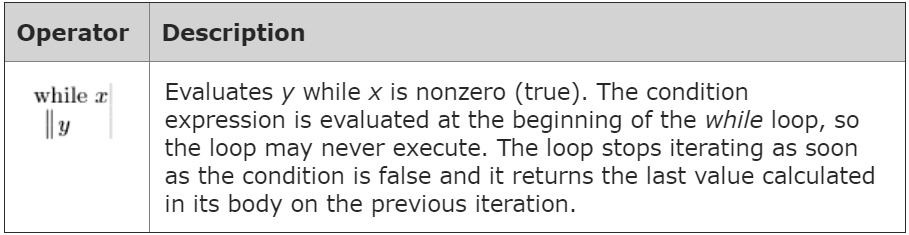

 

                         logic and if statements
We often want to be able to "conditionally" do things in our programs - we want to be able to say "if this thing is true, then do X but if this other thing is true, then do Y." It's like when we wake up in the morning - "if it's raining outside, then I take an umbrella, but if it's sunny, I wear sunglasses." We can do things conditionally in our programs using if statements and if/else statements combined with conditional expressions.
                         
                         while statements
                      
                      
                      
                      
