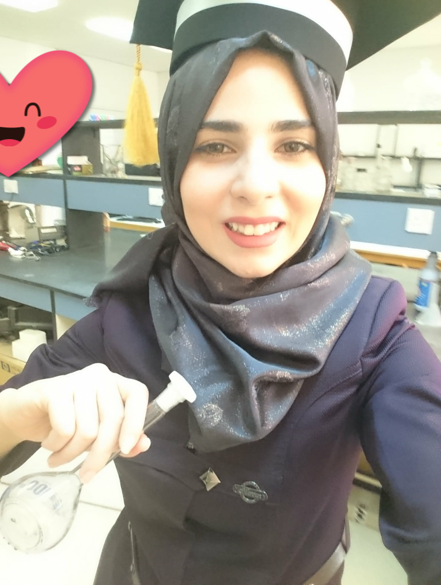

 

______________________________________________________________________________________________________________

____________________________________________________________________________________________________________________

##### 102

| name   | URL (102)                        |
|--------|----------------------------------|
| read01 | [introduction to myself](1.md)   |
| read02 | [Mindset growth](22.md)          |
| read03 | [ch 18 Js](3.md)                 |
| read04 | [ch 1 Js](4.md)                  |
| read05 | [Js loops and conditions](55.md) |
|___________________________________________|

##### 201 

| name    | URL (201)                                                     |
|---------|---------------------------------------------------------------|
| read1   | [HTML,Java summary](201/class01.md)                           |
| read2   | [Basics of HTML, CSS & JS](201/class02.md)                    |
| read3   | [HTML Lists,Flow JS,CSS Box Model](201/class03.md)            |
| read4   | [HTML Links, JS Functions, CSS Layout](201/class04.md)        |
| read5   | [HTML Images; CSS Color & Text](201/class05.md)               |
| read6   | [Problem Domain, Objects, and the DOM](201/class06.md)        |
| read7   | [Object-Oriented Programming, HTML Tables](201/class07.md)    |
| read8   | [More CSS Layout](201/class08.md)                             |
| read9   | [Forms and JS Events](201/class09.md)                         |
| read10  | [JS Debugging](201/class10.md)                                |
| read11  | [Audio, Video, Images](201/class11.md)                        |
| read12  | [Chart.js, Canvas](201/class12.md)                            |
| read13  | [Local Storage](201/class13.md)                               |
| read14a | [CSS Transforms, Transitions, and Animations](201/class14.md) |
| read14b | [CSS Transforms, Transitions, and Animations](201/class15.md) |
|_________________________________________________________________________|

______________________________________________________________________________________________________________
